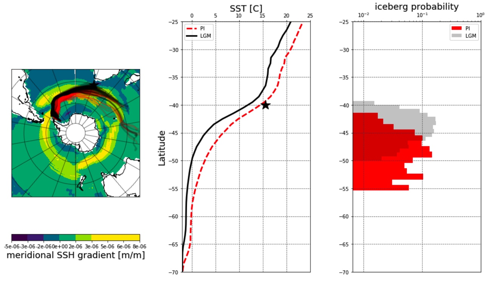

# pyberg, a simple iceberg drift and decay model in Python
Routines and notebooks for computing iceberg trajectories and melting offline

- so far supports reading (interpolated) forcing data from the COSMOS climate model and AWI-CM
- code is based on the Fortran code of FESOM-IB; [reference:](https://doi.org/10.1002/2016JC012513) Rackow, T et al. (2017): A simulation of small to giant Antarctic iceberg evolution: Differential impact on climatology estimates. Journal of Geophysical Research: Oceans, 21 pp, https://doi.org/10.1002/2016JC012513

The Fortran source can be found [here](https://swrepo1.awi.de/scm/viewvc.php/trunk/src/?root=fesom-ib), after registration at [swrepo1.awi.de](https://swrepo1.awi.de).

### pyberg manuscripts and code

The analysis for the published paper

<em>'Antarctic icebergs reorganize ocean circulation during Pleistocene glacials' by
Aidan Starr, Ian R. Hall, Stephen Barker, Thomas Rackow, Xu Zhang, Sidney R. Hemming,
H.J.L van der Lubbe, Gregor Knorr, Melissa A. Berke, Grant R. Bigg, Alejandra Cartagena,
Francisco J. Jiménez-Espejo, Xun Gong, Jens Gruetzner, Nambiyathodi Lathika, Leah J.
LeVay, Rebecca S. Robinson, Martin Ziegler, and the Exp. 361 Science Party</em>

can be reproduced with the following Jupyter [notebook](pyberg_SouthernOceanLead_saveSST_MELT_TRAJ.ipynb). To start from a simpler example script
and to use the latest additions to the code (e.g. ERA5 forcing), please contact [Thomas Rackow](mailto:trackow@awi.de?subject=[GitHub]%20Pyberg%20source) directly.

### example plots using pyberg and COSMOS forcing

**Southern Ocean Iceberg Melt under pre-industrial (PI) vs last glacial maximum (LGM) conditions**

<em>(left) Iceberg trajectories, (middle) sea surface temperature, and (right) iceberg probability between 0-50°E in the Southern Ocean under PI and LGM conditions, using pyberg forced with COSMOS climate model output.</em>
